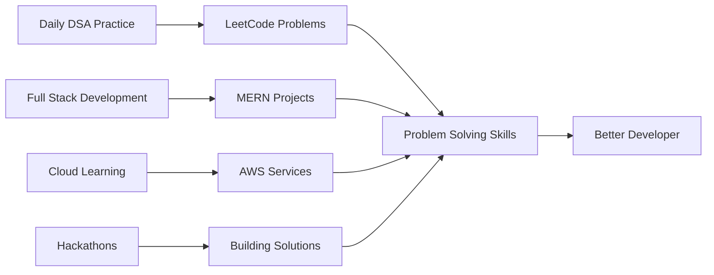

<!-- <div align="center" style="background: linear-gradient(90deg, #ff8a00, #e52e71, #9b00ff); color: white; padding: 20px 0;">
  
</div>

---

<div align="center">
  
  
  
</div>

---

## 🔥 About Me:
- 🌟 Passionate about **Game Development** and **Advanced Animations**.  
- 🎮 Currently working on **GameZone** and **Infinite Dungeon**.  
- 🌱 Exploring **Backend Development** and **API Integration**.  
- 📖 Learning **CSE** and **Hacking** for **Building Secure Games**.  
- 🎯 My goal: Create **World-Class Games** and achieve a **Billion-Dollar Net Worth**!  

---

## 🌐 Socials:
<div align="center">
  <a href="https://linkedin.com/in/dax_CG" target="_blank"></a>
  <a href="https://twitter.com/dax-cg" target="_blank"></a>
  <a href="https://dax-patel.netlify.app/" target="_blank"></a>
</div>

---

## 📊 GitHub Stats:
<div align="center">
  
  
</div>

---

## 🛠️ Tools & Tech Stack:
<div align="center">
  
</div>

---

## 🚀 Highlighted Projects:
- 🎮 [**GameZone**](https://github.com/daxp472/game_zone): High-action multiplayer gaming project.  
- 🧩 [**Infinite Dungeon**](https://github.com/daxp472/Infinite-Dungeon): Puzzle adventure game with dystopian themes.  
- 📽️ [**Ultimate Explore**](https://github.com/daxp472/Ultimate-Explore): API-driven project fetching real-time data.  

---

## 🎨 Custom Animations:
<div align="center">
  
</div>

---

## 💬 Fun Fact:
⚡ I believe the future belongs to **gamers and creators!**  
🤖 Currently experimenting with **game engines** and **API projects**. -->


<div align="center">
  
</div>

<div align="center">
  
</div>

<p align="center">
  
  
  
</p>

<div align="center">
  
</div>

---

## 👨‍💻 About Me

```javascript
const dax = {
    role: "Full Stack Developer & CSE Student",
    location: "Gujarat, India 🇮🇳",
    currentFocus: ["Building Scalable Web Apps", "Cloud Computing", "DSA"],
    dailyRoutine: ["Code", "Learn", "Solve Problems", "Repeat"],
    funFact: "I debug with console.log() and I'm not ashamed! 😄",
    lifeGoal: "Building products that make a difference 🚀"
};
```


- 🔭 **Currently Working On:** Full-stack projects with MERN stack
- 🌱 **Learning:** AWS Cloud Services & Advanced System Design
- 💪 **Daily Practice:** Solving DSA problems on LeetCode
- 🏆 **Hackathon Participant:** Building innovative solutions under pressure
- 🎯 **2025 Goal:** Contribute to Open Source & Master Cloud Architecture
- 💬 **Ask Me About:** React, Node.js, MongoDB, or anything web development
- ⚡ **Philosophy:** "Write code that speaks for itself"

---

## 🛠️ Tech Arsenal

<details open>
<summary><b>🎨 Frontend Development</b></summary>
<br>


</details>

<details open>
<summary><b>⚙️ Backend Development</b></summary>
<br>


</details>

<details open>
<summary><b>🗄️ Database & Caching</b></summary>
<br>


</details>

<details open>
<summary><b>☁️ Cloud & Tools (Learning)</b></summary>
<br>


</details>

---

## 📊 GitHub Analytics

<!-- <div align="center">
  
  
</div> -->

<div align="center">
  
</div>

<div align="center">
  
</div>

---

## 🏆 GitHub Trophies


---

## 🚀 Featured Projects

<div align="center">

<a href="[https://github.com/daxp472/game_zone](https://github.com/daxp472/game_zone)">
  
</a>

<a href="[https://github.com/daxp472/Infinite-Dungeon](https://github.com/daxp472/ODOO_25)">
  
</a>

<a href="[https://github.com/daxp472/Ultimate-Explore](https://github.com/daxp472/Expense_Odoo)">
  
</a>

</div>

---

## 💼 What I'm Working On



---

## 🔥 Current Streak & Stats

<div align="center">
  
| 🎯 Focus Area | 📈 Status |
|---------------|-----------|
| 💻 DSA Practice | Daily on LeetCode |
| 🚀 Projects | Building Full-Stack Apps |
| ☁️ Cloud | Learning AWS |
| 🏆 Hackathons | Active Participant |
| 📚 Learning | System Design & Architecture |

</div>

---

## 🌐 Connect With Me

<div align="center">

[](https://linkedin.com/in/dax-CG)
[](https://twitter.com/dax_cg)
[](https://dax-patel.netlify.app/)
[](https://leetcode.com/daxCG)
[](mailto:daxpatel.cg@gmail.com)

</div>

---

## 💭 Dev Quote

<div align="center">
  
</div>

---

## 📈 Activity Graph

<div align="center">
  
</div>

---

## 🎯 2026 Goals

- 🌟 Master Cloud Architecture with AWS
- 🚀 Contribute to 10+ Open Source Projects
- 💼 Build 5 Production-Ready Full-Stack Applications
- 🏆 Participate in 15+ Hackathons
- 📚 Learn System Design & Microservices
- 🎓 Complete Advanced DSA Patterns
- 🌐 Build a Strong Developer Community

---

## 💡 Fun Facts

- 🎮 Started coding journey with game development
- ⚡ Can debug code faster with music on
- 🌙 Night owl - best code happens after midnight
- ☕ Coffee is my debugging tool
- 🎨 Believe in "Code is Art"
- 🚀 Dream: Build products used by millions

---

<div align="center">
  
</div>

<div align="center">
  
</div>

<div align="center">
  
### Show some ❤️ by starring some of my repositories!
